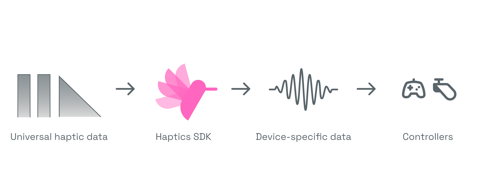
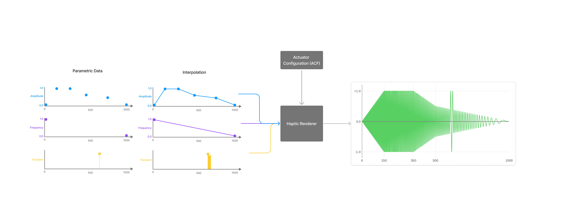

[](LICENSE)

A low-level haptic rendering and data processing library based on a universal
format. Designed as a core component for integration into game engines, audio
middleware, and other systems, Haptics SDK runs in production across millions of
devices daily.

---

## Table of Contents

- [Feature overview](#feature-overview)
- [Industry Adoption](#industry-adoption)
- [Getting Started](#getting-started)
  - [Prerequisites](#prerequisites)
  - [Quick Start](#quick-start)
  - [Building](#building)
- [Examples](#examples)
- [How It Works](#how-it-works)
- [Design Philosophy](#design-philosophy)
- [Documentation](#documentation)
- [FAQ](#faq)
- [Contributing](#contributing)
- [License](#license)

---

## Feature overview



### 🎨 Platform-Agnostic Haptic Input Data

Works with normalized haptic parameters such as amplitude, frequency, and
transients, rather than raw waveforms. This approach aligns with the broader
industry shift toward standardized, device-agnostic haptic data structures (not
only via the `.haptic` format in this repo but also Apple's `.ahap` format). By
separating haptic design intent from device playback capabilities, you can
ensure consistent experiences across diverse hardware.

### ⚙️ Configuration-Based Render Output

Actuator Configuration Files (ACF) define how abstract haptic data maps to
specific hardware. This makes it easy to support multiple output platforms
without modifying your code, streamlining integration and maintenance.

### 🎛️ Dual Rendering Modes

Supports a wide range of platform API and device capabilites, including both
PCM-based systems and those based on simple amplitude curves.

### 🔧 Integration Friendly

- **No external dependencies** - Standalone C/C++ source code
- **Minimal API surface** - Simple, easy-to-understand integration points
- **Cross-platform** - Windows, macOS, Linux, consoles & firmware

---

## Industry Adoption

Meta Haptics SDK serves as the core haptic rendering technology in major tools
and platforms:

### Audio Middleware

Natively integrated into professional audio middleware:

- **[FMOD Haptics Instrument](https://www.fmod.com/docs/2.03/studio/instrument-reference.html#haptics-instrument)** -
  Native haptic authoring for PlayStation® (including DualSense™), Xbox, and
  Meta Quest
- **[Wwise Haptic Clip Player](https://www.audiokinetic.com/en/public-library/2025.1.6_9117/?source=Help&id=haptic_clip_player_plug_in)** -
  Audiokinetic's native haptic authoring integration

### Game Engines

- **[Meta Haptics SDK for Unity](https://developers.meta.com/horizon/documentation/unity/unity-haptics-sdk/)** -
  Quest and PCVR haptics for Unity applications
- **[Meta Haptics SDK for Unreal](https://developers.meta.com/horizon/documentation/unreal/unreal-haptics-sdk/)** -
  Quest and PCVR haptics for Unreal Engine applications

### Design Tools

- **[Meta Haptics Studio](https://developers.meta.com/horizon/resources/haptics-studio)** -
  Professional haptic design tool using this SDK as its core renderer on
  Windows, Mac and Meta Quest's Android based runtime.

---

## Getting Started

### Prerequisites

#### Build Tools

- **[CMake](https://cmake.org/)** 3.10 or higher
- **[just](https://github.com/casey/just)** (optional, makes building and
  testing more convenient)
- C/C++ compiler (GCC, Clang, MSVC, or other)

#### Supported Platforms

- Windows (MSVC, MinGW)
- macOS (Clang)
- Linux (GCC, Clang)
- VR headsets (Quest, PCVR)
- Consoles (PlayStation®, Xbox)

### Quick Start

```bash
# Clone the repository
git clone git@github.com:facebook/meta-haptics-sdk.git
cd meta-haptics-sdk

# Initialize submodules
git submodule init
git submodule update
```

### Building

#### Using `just` (Recommended)

```bash
just            # Build and test all components
just build-all  # Build all components without testing
```

#### Using CMake

The justfile in the directory of each component contains the CMake commands.

---

## Examples

### 1. Authoring a .haptic file

.haptic files contain the contents of a haptic effect.

#### Example .haptic File

```json
{
  "version": {"major": 1, "minor": 0, "patch": 0},
  "metadata": {
    "editor": "Meta Haptics Studio",
    "description": "Button click effect"
  },
  "signals": {
    "continuous": {
      "envelopes": {
        "amplitude": [
          {"time": 0.0, "amplitude": 0.0},
          {
            "time": 0.05,
            "amplitude": 1.0,
            "emphasis": {"amplitude": 1.0, "frequency": 1.0}
          },
          {"time": 0.1, "amplitude": 0.0}
        ],
        "frequency": [
          {"time": 0.0, "frequency": 0.7},
          {"time": 0.1, "frequency": 0.3}
        ]
      }
    }
  }
}
```

#### Key Concepts

- **Amplitude Envelope** - Controls intensity over time (0.0 = silent, 1.0 =
  strong)
- **Frequency Envelope** - Controls pitch/texture (0.0 = round, 1.0 = sharp)
- **Emphasis** - Short, transient events (clicks, impacts) attached to amplitude
  points
- **Normalized Values** - All values are 0.0-1.0; the renderer maps to hardware
  via ACF

**Design Tools:** Create `.haptic` files visually using
[Meta Haptics Studio](https://developers.meta.com/horizon/resources/haptics-studio)
or author them by hand.

**.haptic Specification:**
[`resources/haptic-file-spec.md`](resources/haptic-file-spec.md)

### 2. Authoring an Actuator Configuration File (ACF)

ACF files define device-specific characteristics, translating normalized haptic
data (0.0-1.0) into hardware-appropriate parameters.

#### Example ACF (Generic PCM Console)

```json5
{
  metadata: {
    version: '1.0.0',
    device: 'Generic console PCM',
    author: 'Author name',
  },
  continuous: {
    gain: 0.8, // Master volume for continuous vibration
    emphasis_ducking: 0.5, // Reduce continuous by 50% during transients
    frequency_min: 55.0, // Map 0.0 frequency → 55 Hz
    frequency_max: 200.0, // Map 1.0 frequency → 200 Hz
  },
  emphasis: {
    gain: 1.0, // Full strength transients
    fade_out_percent: 0.0,
    frequency_min: {
      output_frequency: 55.0, // Low sharpness: 55 Hz
      duration_ms: 27.0, // ~1.5 cycles
      shape: 'sine', // Smooth waveform
    },
    frequency_max: {
      output_frequency: 130.0, // High sharpness: 130 Hz
      duration_ms: 20.0, // As short as possible
      shape: 'square', // Sharp waveform
    },
  },
}
```

#### Provided ACF Templates

- **[`Generic-Console-PCM.acf`](resources/acf/Generic-Console-PCM.acf)** - Full
  waveform synthesis (PlayStation® DualSense, etc.)
- **[`Generic-Console-SimpleHaptics.acf`](resources/acf/Generic-Console-SimpleHaptics.acf)** -
  Amplitude-only output (Xbox, etc.)
- **[`Meta-Quest.acf`](resources/acf/MetaQuest.acf)** - Meta Quest controller
  tuning

**Tuning Your ACF:** Start with a template and tune by feel. Adjust frequency
ranges based on your actuator's datasheet and perceptual testing.

**ACF Specification:** [`resources/acf/README.md`](resources/acf/README.md)

### 3. Parsing and Rendering Haptic Data in C++

To parse and render haptic data you need a `.haptic` file and an ACF (see
examples above). Then do the following:

1. Convert the `.haptic` to a ParametricHapticClip using the Parametric Haptic
   Data library.
2. Initialize ParametricHapticRenderer with the render settings from the ACF and
   the ParametricHapticClip.
3. From an update loop or callback, preferably running at a fixed clock rate,
   drive ParametricHapticRenderer in realtime.

**[View Parametric Haptic Renderer Example](core/renderer_parametric/README.md)**

### 4. PCM Haptics for Unity and Unreal

Complete integration examples for Unity and Unreal demonstrating how to render haptics on
devices that implement OpenXR PCM haptics (Meta Quest).

**[View Unity Example](interfaces/unity/PCMHaptics/README.md)**

**[View Unreal Example](interfaces/unreal/PCMHaptics/README.md)**

---

## How It Works

Meta Haptics SDK is a haptic rendering library with a five-component
architecture that separates content from hardware.

### Core Components

The SDK consists of five main components that work together:

1. **.haptic Files (Specification: `resources/haptic-file-spec.md`)**: The
   `.haptic` format is a JSON-based, device-agnostic representation of
   vibrotactile effects. This repository open-sources the `.haptic` file
   specification, but the underlying renderer is **file format agnostic** and
   easily compatible with similar parametric formats like Apple's AHAP. The
   format is designed for interchange between design tools, game engines, and
   runtime systems.

2. **Parametric Haptic Data (`core/haptic_data_parametric`)**: A C++ library for
   the file format used by Parametric Haptic Renderer (below). It takes .haptic
   files as input and converts them to Parametric Haptic Data.

3. **Actuator Configuration Files (ACF) (`resources/acf`)**: JSON5 configuration
   files that define how normalized haptic data (0.0-1.0) within .haptic files
   (and Parametric Haptic Data) maps to specific hardware characteristics. They
   contain device-specific parameters like frequency ranges, gain curves, and
   transient waveform shapes.

4. **Parametric Renderer (`core/renderer_parametric`)**: A realtime rendering
   C++ library. You initialize it with Parametric Haptic Data and ACF data and
   then drive it from update loop or callback. In turn it has Haptic Renderer
   (see below) render slices of parametric data to a the format required by the
   platform haptic API.

5. **Haptic Renderer (`core/renderer_c`)**: A lightweight C library that
   processes parametric control points (amplitude and frequency ramps,
   transients) and generates output samples according to the ACF at a target
   sample rate. It operates in real-time, maintaining internal state for smooth
   interpolation between control points.

### Rendering Process

Meta Haptics SDK interpolates between hardware-agnostic parametric control
points, and based on the ACF, renders the optimal output for the platform API or
device hardware.



_The renderer processes time-based control points (amplitude, frequency,
transients) and generates device-specific output samples._

This separation enables:

- Targeting any configured hardware with the same content
- Tuning haptic feel per-device via ACF configuration
- Using the same content pipeline across all platforms

---

## Design Philosophy

Meta Haptics SDK uses **normalized, parametric data** to distinctly separate
design-time concerns from runtime implementation. This approach provides
significant benefits for both content creators and system integrators.

### A Low-Level Building Block for Haptic Systems

Meta Haptics SDK is a **haptic rendering and data processing library** designed
to be integrated into larger systems. It focuses on a single responsibility:
efficiently converting device-agnostic vibrotactile data into device and
platform-specific output.

**What it provides:**

- Real-time rendering of parametric haptic data (amplitude/frequency envelopes,
  transients)
- Device-specific adaptation through Actuator Configuration Files (ACF)
- Pure C/C++ implementation with zero external dependencies
- File format agnostic renderer compatible with `.haptic`, AHAP, or similar
  formats

**What it doesn't provide:**

- High-level playback APIs (play, stop, pause, seek) or playback location.
- Haptic prioritization or mixing systems
- Threading models or process communication
- Asset management or file I/O

This design allows integration into systems that already have their own models
for playback control, threading, and resource management—such as game engines,
audio middleware, and platform runtimes.

### For Haptic Designers

Hardware capabilities vary widely across platforms—from high-end console
controllers to simple gamepads. Requiring designers to create platform-specific
haptic assets is highly inefficient:

- **Haptics typically has the lowest priority and smallest budget** in most
  projects
- **Rework is cost-prohibitive** - designers need to author once and deploy
  everywhere
- **Design intent, not hardware specifics** - normalized envelopes (0.0-1.0)
  capture what designers want to express, not how specific motors should vibrate

By storing only design intent in normalized primitives, the system enables:

- **Graceful degradation** on lower-capability hardware
- **High-quality output** on advanced systems
- **Cross-platform compatibility** - haptics work on new platforms without
  rework
- **Forward and backward compatibility** - content remains valid as systems
  evolve

### For System Integrators

Middleware and game engine creators need maintainable solutions across numerous
platforms. This SDK provides:

- **Configuration-based rendering** - add new platforms with ACF files, not code
  changes
- **No upstream content changes** - existing `.haptic` files work on new
  platforms automatically
- **Cost-effective maintenance** - minimal engineering effort for platform
  support

### Why Not PCM?

Many systems use PCM (Pulse Code Modulation) as their haptic data format, but
**PCM leaks hardware abstraction into the design**:

- PCM waveforms encode frequency information specific to target hardware
- Designers must re-render PCM files for every platform with different motor
  characteristics
- Changes in hardware require re-authoring all content

**Parametric data** solves this by describing _what_ to feel (amplitude,
frequency, transients), not _how_ motors should move. The renderer handles
hardware translation at runtime.

---

## Documentation

### Complete Documentation Set

| Document                                                             | Description                                    |
| -------------------------------------------------------------------- | ---------------------------------------------- |
| **[Parametric Haptic Renderer](core/renderer_parametric/README.md)** | Complete documentation and integration example |
| **[Parametric Haptic Data](core/haptic_data_parametric/README.md)**  | Short description                              |
| **[.haptic File Spec](resources/haptic-file-spec.md)**               | Format specification with validation rules     |
| **[ACF Specification](resources/acf/README.md)**                     | Tuning guide and parameter reference           |
| **[Unity PCM Haptics](interfaces/unity/PCMHaptics/README.md)**       | Complete integration example                   |
| **[Unreal PCM Haptics](interfaces/unreal/PCMHaptics/README.md)**     | Complete integration example                   |

### External Resources

- **[Meta Haptics Studio](https://developers.meta.com/horizon/resources/haptics-studio)** -
  Design tool for creating .haptic files

---

## FAQ

### General Questions

**Q: What platforms does Meta Haptics SDK support?**

**A: The SDK is platform-agnostic C/C++ code.** It runs on Windows, macOS,
Linux, and consoles. Integration examples focus on Meta Quest via OpenXR.

**Q: Can I use this with my existing game engine?**

**A: Yes!** The SDK integrates into Unity, Unreal, FMOD, and Wwise. You can also
integrate directly into custom engines—it's just C/C++.

**Q: Do I need Meta hardware to use this?**

**A: No.** While the SDK powers Meta Quest haptics, it's designed to work with
any vibrotactile actuator. Use the ACF system to tune for your target hardware.

**Q: Is this only for VR?**

**A: No.** The SDK works with any haptic-enabled device: VR controllers, PCVR,
game console controllers (PlayStation® DualSense™, Xbox), and more.

### Technical Questions

**Q: When should I use Synthesis vs Amplitude Curve mode?**

**A:**

- **Synthesis Mode** - When the platform supports PCM waveforms (Quest,
  DualSense). Provides full frequency control.
- **Amplitude Curve Mode** - When the platform only accepts amplitude values
  (some Android APIs, simpler consoles).

**Q: How do I tune an ACF for my hardware?**

**A:**

1. Start with a template ACF (e.g., `Generic-Console-PCM.acf`)
2. Consult your actuator's datasheet for frequency response
3. Set `frequency_min`/`frequency_max` to the usable range (e.g., 55-200 Hz)
4. Tune emphasis settings around the resonant frequency (f₀)
5. Test with real content and adjust by feel

See the [ACF specification](resources/acf/README.md) for detailed guidance.

**Q: Can I create .haptic files programmatically?**

**A: Yes.** The [.haptic specification](resources/haptic-file-spec.md) defines
the data format. You can generate files in any language and validate against the
spec.

**Q: What's the difference between emphasis and transients?**

**A: They're the same concept, different terminology.** "Emphasis" is the term
used in the renderer API, "transient" is used in haptic design (short,
click-like events).

### Compatibility Questions

**Q: Can I use .haptic files created in Meta Haptics Studio?**

**A: Absolutely!** That's the primary design workflow. Studio exports .haptic
files that this SDK renders at runtime.

---

## Contributing

We welcome contributions! Whether you're fixing bugs, adding platform examples,
or improving documentation, your help is greatly appreciated. To set
expectations: the maintainers of this repository are committed to strong
stewardship of its technical direction and feature set. As a result, not every
suggestion or contribution may be accepted. However, please don't let that
discourage you: we're a friendly team and always happy to discuss your ideas for
improvements!

Thank you for your interest in making this project better.

See our [Contribution Guidelines](CONTRIBUTING.md) for more information.

### Code of Conduct

See our [Code of Conduct](CODE_OF_CONDUCT.md)

---

## License

Meta Haptics SDK is released under the MIT License. See [LICENSE](LICENSE) for
details.

---

**Need help?**

Open an issue or check our [documentation](#documentation).

**Ready to design haptics?**

Download
[Meta Haptics Studio](https://developers.meta.com/horizon/resources/haptics-studio).

---

Built with love by Meta's IxI Haptics team (formerly Lofelt ❤️)
