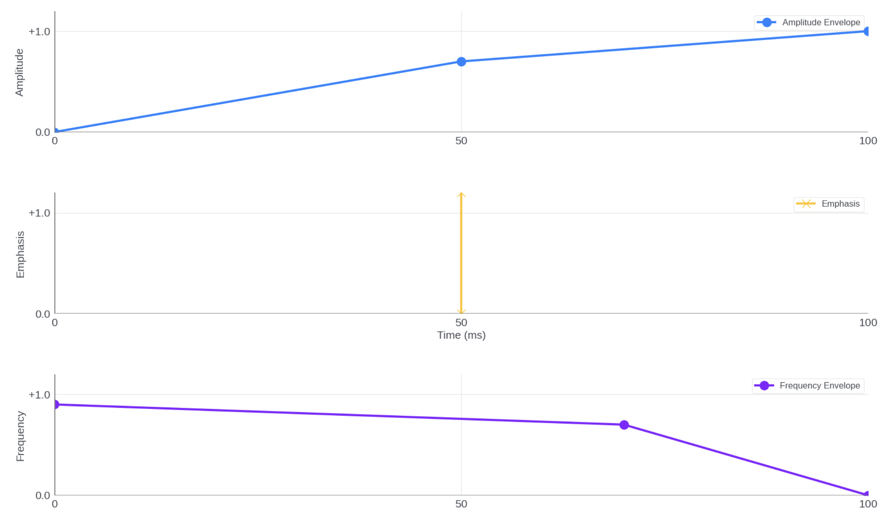
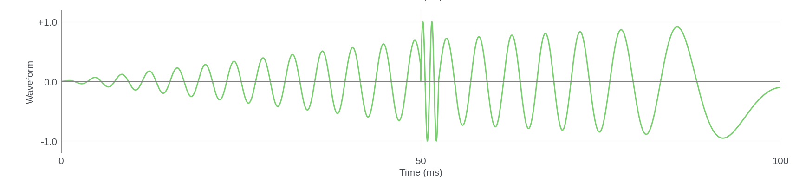
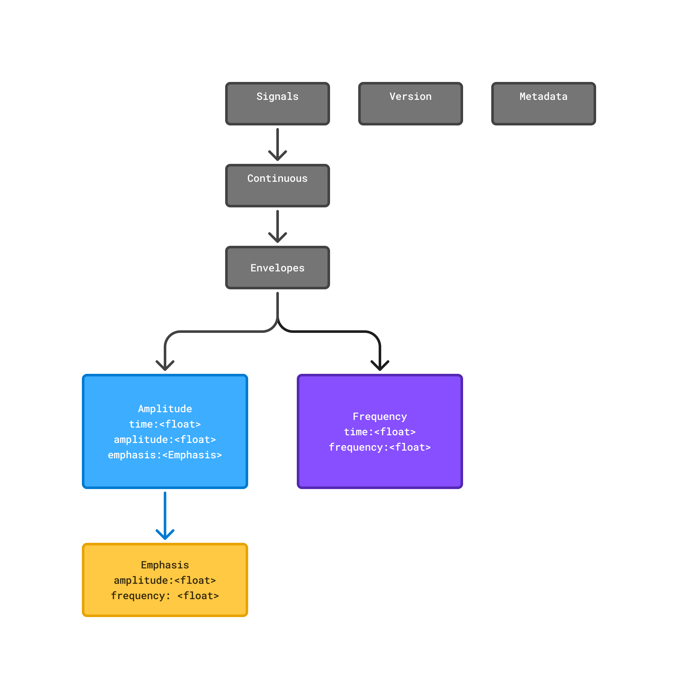

# .haptic File Specification 1.0

## Overview

The `.haptic` file format is a device-agnostic, JSON-based standard for
representing vibrotactile haptic effects. It is intended to facilitate reliable
interchange between authoring tools (such as Meta Haptics Studio), SDKs, and
runtime engines.

This specification abstracts the design intent of haptic effects, decoupling
effect definition from playback hardware. The format serves as an asset
interchange layer between haptic designers at design time and implementation
engineers at runtime. It is intended to be both machine and human readable for
workflow convenience between engineering and design disciplines.

This specification defines only the content of the haptic effect (what should be
played), and does not specify the playback location (where the effect should be
rendered, such as on a specific body part or controller). The assignment of
haptic effects to specific locations is context-dependent, dynamic, and
typically determined at runtime by the integration software (e.g., game engine
or SDK). As a result, location is treated as an implementation detail and is not
included in the `.haptic` file format.

Interpretation and rendering of `.haptic` files are handled by the runtime and
rendering stack, in conjunction with the Actuator Configuration File (ACF). The
renderer is responsible for mapping the abstract haptic description to the
capabilities of the attached hardware, providing the best possible playback and
gracefully degrading when certain features are unsupported.

This document defines the requirements for reading, writing, and processing
`.haptic` files, version 1.0.

## Minimal Valid Example

The simplest valid `.haptic` file contains only the required fields:

```json
{
  "version": {"major": 1, "minor": 0, "patch": 0},
  "metadata": {},
  "signals": {
    "continuous": {
      "envelopes": {
        "amplitude": [
          {"time": 0.0, "amplitude": 0.0},
          {"time": 1.0, "amplitude": 0.0}
        ],
        "frequency": []
      }
    }
  }
}
```

## More Detailed Example

```json
{
  "version": {"major": 1, "minor": 0, "patch": 0},
  "metadata": {
    "editor": "Meta Haptics Studio 2.1",
    "source": "example-sound.wav",
    "project": "example-project.hasp",
    "tags": [],
    "description": "File Specification Example Effect"
  },
  "signals": {
    "continuous": {
      "envelopes": {
        "amplitude": [
          {"time": 0.0, "amplitude": 0.0},
          {
            "time": 0.05,
            "amplitude": 0.7,
            "emphasis": {"amplitude": 1.0, "frequency": 1.0}
          },
          {"time": 0.1, "amplitude": 1.0}
        ],
        "frequency": [
          {"time": 0.0, "frequency": 0.9},
          {"time": 0.07, "frequency": 0.7},
          {"time": 0.1, "frequency": 0.0}
        ]
      }
    }
  }
}
```

### Detailed Example Visualization



_This graph shows the parametric representation of the haptic effect: the blue
line represents amplitude (intensity) over time, the orange dot indicates an
emphasis (transient) event, and the purple line represents frequency (pitch)
over time._

### Waveform Output



_This waveform shows the rendered output signal that would be sent to the haptic
actuator hardware. The parametric curves above are translated into this
continuous signal by the renderer._

## Specification



A `.haptic` file is a single JSON object with three top-level sections:

```json
{
  "version": { ... },
  "metadata": { ... },
  "signals": { ... }
}
```

### version Object

Specifies the schema version for systems to correctly parse the tree.

| Field | Type    | Description                 | Required |
| ----- | ------- | --------------------------- | -------- |
| major | integer | Major version of the schema | Yes      |
| minor | integer | Minor version of the schema | Yes      |
| patch | integer | Patch version of the schema | Yes      |

```json
"version": { "major": 1, "minor": 0, "patch": 0 }
```

### metadata Object

The metadata object provides information about the origin and context of the
`.haptic` file. It enables designers and engineers to understand the background
and relevant details of the haptic asset, such as its creator, source, project
association, and descriptive tags.

| Field       | Type          | Description                                 | Required |
| ----------- | ------------- | ------------------------------------------- | -------- |
| author      | string        | Name/email of the creator                   | No       |
| editor      | string        | Tool/version used to create the file        | No       |
| source      | string        | Path or reference to original audio/project | No       |
| project     | string        | Project name                                | No       |
| tags        | array[string] | Freeform tags for search/categorization     | No       |
| description | string        | Human-readable description of the effect    | No       |

```json
"metadata": {
  "editor": "Meta Haptics Studio 2.1",
  "source": "example-sound.wav",
  "project": "example-project.hasp",
  "tags": ["example", "demo"],
  "description": "File Specification Example Effect"
}
```

### signals Object

The signals object is the top-level container for all haptic signal data within
the `.haptic` file. It is designed to support future extensibility, allowing the
format to accommodate additional types of haptic effects beyond vibrotactile
signals.

Currently, it organizes different categories of haptic signals (such as
continuous envelopes for amplitude and frequency), and provides a structure that
can be expanded to include other effect types as the format evolves.

| Field                | Type   | Description                 | Required |
| -------------------- | ------ | --------------------------- | -------- |
| continuous.envelopes | object | Continuous haptic envelopes | Yes      |

### continuous.envelopes Object

The `continuous.envelopes` object contains the data for vibrotactile effects,
encoding the haptic effect as time-based envelopes. This structure enables
systems to interpret and render the intended effect across different hardware
platforms.

It defines two continuous envelopes, each represented as a series of time-value
breakpoints:

- **Amplitude envelope**: Specifies how the intensity of the vibration changes
  over time.
- **Frequency envelope**: Specifies how the pitch of the vibration changes over
  time.

| Field     | Type             | Description                    | Required |
| --------- | ---------------- | ------------------------------ | -------- |
| amplitude | array[Amplitude] | Array of amplitude breakpoints | Yes      |
| frequency | array[Frequency] | Array of frequency breakpoints | Yes      |

```json
"signals": {
  "continuous": {
    "envelopes": {
      "amplitude": [
        { "time": 0.0, "amplitude": 0.5 },
        { "time": 1.0, "amplitude": 0.8 }
      ],
      "frequency": [
        { "time": 0.0, "frequency": 0.3 },
        { "time": 1.0, "frequency": 0.7 }
      ]
    }
  }
}
```

### Amplitude Envelope

The amplitude envelope is an array of objects, each representing a time-value
pair that defines how the strength or intensity of the haptic effect changes
over time.

#### Amplitude Object

| Field     | Type   | Description                                                                       | Required |
| --------- | ------ | --------------------------------------------------------------------------------- | -------- |
| time      | float  | Time in seconds (≥ 0)                                                             | Yes      |
| amplitude | float  | Normalized amplitude/intensity value (0.0–1.0). 0 = lowest amplitude.             | Yes      |
| emphasis  | object | Optional transient subtree (see below). Maximum 1 occurrence per amplitude point. | No       |

**Note on Normalized Values:** All amplitude and frequency values are normalized
to the range 0.0–1.0. The runtime renderer maps these abstract values to actual
hardware capabilities:

- `amplitude: 0.0` = No vibration

- `amplitude: 0.5` = Medium intensity (50% of hardware capability)

- `amplitude: 1.0` = Maximum intensity (100% of hardware capability)

The actual physical vibration intensity depends on the target hardware.

#### Emphasis Object

The emphasis object is an optional child of an amplitude breakpoint. It
describes a transient—typically a sharp, click-like effect—at a specific point
in time within the amplitude envelope. The emphasis object is included only when
a transient is required for the haptic effect.

**Platform Specifics:**

- **iOS**: An emphasis point typically maps to a Transient object in the iOS
  Core Haptics API, triggering a short, distinct haptic pulse.
- **PCM-based systems**: The same emphasis point is typically rendered as 1–2
  cycles of a square wave signal, producing a brief, high-intensity vibration.

This approach allows the `.haptic` format to abstractly specify transients,
while the runtime or SDK implementation determines the most appropriate
rendering method for the target platform.

| Field     | Type  | Description                                     | Required |
| --------- | ----- | ----------------------------------------------- | -------- |
| amplitude | float | Normalized intensity of the transient (0.0–1.0) | Yes      |
| frequency | float | Normalized sharpness of the transient (0.0–1.0) | Yes      |

**Emphasis Example Comparison:**

_Without emphasis (smooth vibration):_

```json
{"time": 0.5, "amplitude": 0.8}
```

_With emphasis (sharp click at that moment):_

```json
{
  "time": 0.5,
  "amplitude": 0.8,
  "emphasis": {
    "amplitude": 1.0,
    "frequency": 1.0
  }
}
```

#### Validation Rules

- **Minimum breakpoints**: At least two breakpoints required (start and end),
  with duration > 0
- **Time ordering**: Breakpoints sorted in non-decreasing order by time
  (duplicate times allowed but not recommended)
- **Value ranges**: Amplitude values within 0.0–1.0
- **Emphasis constraints**:
  - `emphasis.amplitude` must be ≥ base envelope amplitude at that point (not
    just ≥ 0.0)
  - `emphasis.frequency` must be within 0.0–1.0

### Frequency Envelope

The frequency envelope is an array of objects, each representing a time-value
pair that defines how the pitch of the haptic effect changes over time.

#### Frequency Breakpoint Object

| Field     | Type  | Description                    | Required |
| --------- | ----- | ------------------------------ | -------- |
| time      | float | Time in seconds (≥ 0)          | Yes      |
| frequency | float | Normalized frequency (0.0–1.0) | Yes      |

```json
{
  "time": 0.5,
  "frequency": 0.6
}
```

**Validation:**

- **Empty or omitted is valid** - If the frequency array is empty `[]` or
  omitted, the system uses a default frequency (typically 0.5)
- **Can be shorter than amplitude** - If the frequency envelope ends before the
  amplitude envelope, the system continues with the last frequency value
- **Duration is determined by amplitude** - The haptic effect duration is always
  defined by the last amplitude breakpoint, not the frequency envelope
- **Time ordering**: Breakpoints sorted in non-decreasing order by time
- **No overshoot**: No frequency breakpoint can occur after the end of the
  amplitude envelope
- **Value ranges**: Frequency values within 0.0–1.0

## Complete Example

```json
{
  "version": {"major": 1, "minor": 0, "patch": 0},
  "metadata": {
    "editor": "Meta Haptics Studio 2.1",
    "source": "gear.wav",
    "project": "machine-interactions.hasp",
    "tags": [],
    "description": "A gear being cranked"
  },
  "signals": {
    "continuous": {
      "envelopes": {
        "amplitude": [
          {"time": 0.0, "amplitude": 0.0},
          {"time": 0.2, "amplitude": 0.11},
          {"time": 0.48, "amplitude": 0.18},
          {
            "time": 0.49,
            "amplitude": 0.71,
            "emphasis": {"amplitude": 0.8, "frequency": 0.5}
          },
          {"time": 0.61, "amplitude": 0.08},
          {"time": 0.91, "amplitude": 0.0}
        ],
        "frequency": [
          {"time": 0.0, "frequency": 0.0},
          {"time": 0.01, "frequency": 0.73},
          {"time": 0.15, "frequency": 0.48},
          {"time": 0.18, "frequency": 0.46},
          {"time": 0.48, "frequency": 0.98},
          {"time": 0.82, "frequency": 0.7},
          {"time": 0.91, "frequency": 0.0}
        ]
      }
    }
  }
}
```

## Implementation Guidance

### For Parser Authors

- **Validate all required fields** before processing the file
- **Support graceful degradation** for unknown metadata fields (future-proofing)
- **Enforce monotonic time ordering** during parsing to catch authoring errors
  early
- **Validate emphasis constraints** - Ensure emphasis amplitude is not less than
  envelope amplitude at that point
- **Handle empty arrays correctly** - Empty frequency array `[]` is valid

### For Authoring Tool Developers

- **Always include metadata** - Especially `editor`, `source`, and `description`
  fields for traceability
- **Use descriptive tags** - Help users find and categorize effects in large
  libraries
- **Validate on export** - Run validation checks before writing files to catch
  errors early
- **Test edge cases** - Single breakpoint rejection, emphasis validation, empty
  envelopes
- **Provide visual feedback** - Show users the parametric curves and include the
  system icon where appropriate

## System Icon

When incorporating the `.haptic` file format into your system, it is recommended
to use the official `.haptic` file icon to visually represent `.haptic` assets.
This helps users quickly identify haptic files in user interfaces, file
browsers, editors, and asset management tools.

<p align="center">
  
</p>

**Download:**

- [SVG](images/haptic_file_spec/icons/haptic-file-icon-256x256.svg)
- [macOS (.icns)](images/haptic_file_spec/icons/haptic-file-icon.icns)
- [Windows (.ico)](images/haptic_file_spec/icons/haptic-file-icon.ico)

### Guidelines

1. **Placement:**
   - Use the `.haptic` icon wherever `.haptic` files are listed, referenced, or
     selectable (e.g., file pickers, asset libraries, export dialogs).
   - The icon should appear alongside the file name and extension (e.g.,
     `effect.haptic`).

2. **Sizing and Scaling:**
   - The icon should be displayed at a size consistent with other file type
     icons in your UI.
   - Maintain the icon's aspect ratio and clarity at all supported resolutions.

3. **File Association:**
   - Associate the `.haptic` file extension with the icon in your operating
     system or application, so `.haptic` files are visually distinct from other
     file types.

4. **Accessibility:**
   - Provide appropriate alt text or tooltips, such as "Haptic File (.haptic)",
     for accessibility and screen readers.

5. **Branding and Consistency:**
   - Do not modify the icon's colors, proportions, or design elements.
   - Use the icon only to represent `.haptic` files and not for other file types
     or purposes.
